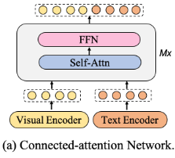
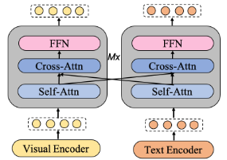
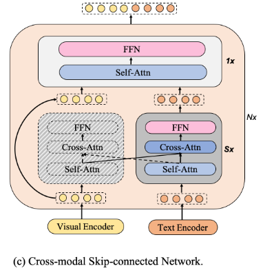
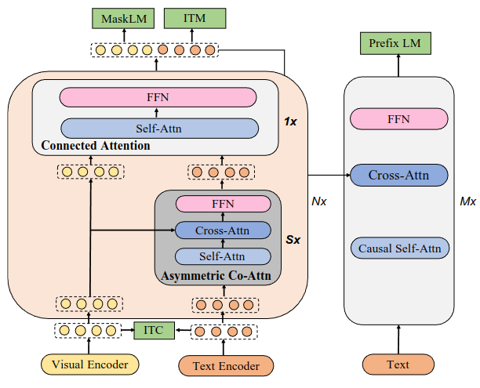
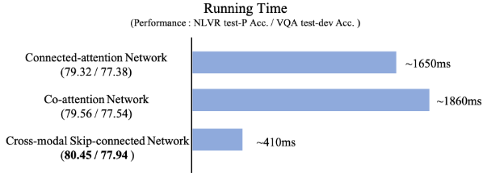

Abstract

các pre-trained mô hình hiện nay đều gặp phải vấn đề về hiệu quả tính toán thấp và sự bất đối xứng thông tin do chuỗi hình ảnh dài trong việc căn chỉnh đa phương thức (cross-modal alignment)

mPLUG giới thiệu một kiến trúc ngôn ngữ thị giác effective và eficient với các kết nối bỏ qua đa phương thức (cross-modal skip-connections) mới, tạo ra các lối tắt giữa các lớp, bỏ qua một số lớp nhất định để self-attention hoàn toán về phía thị giác.

sử dụng cả hai hàm discriminative và generative objectives

Đạt SOTA trên image captioning, image-text retrieval, visual grounding, visual question answering, multiple video-language tasks

1 Introduction

Các mô hình ngôn ngữ thị giác hiện nay học cách biểu diễn đa phương thức từ một số cặp văn bản-hình ảnh bằng cách căn chỉnh các phương thức ngôn ngữ và hình ảnh. Một thách thức lớn của việc học các mô hình ngôn ngữ thị giác là tìm ra sự liên kết tốt giữa hai phương thức để thu hẹp khoảng cách ngữ nghĩa ở giữa

để phát hiện một cross-modal alignment tốt, một số nghiên cứu trước đã sử dụng một mô hình phát hiện vật thể đã được pretrained để trích xuất các vùng nổi bật từ hình ảnh, sau đó liên kết chúng với language counterparts. Phương pháp này thường bị giới hạn bởi sức mạnh của mô hình phát hiện vật thể, ngữ nghĩa trực quan được xác định trước (pre-defined visual semantics) mà mô hình có thể biểu thị và số lượng chú thích có sẵn. Ngoài ra, việc trích xuất các đặc điểm hình ảnh dựa trên vùng từ hình ảnh có độ phân giải cao cũng tốn kém về mặt tính toán

các nghiên cứu mới hơn trích xuất hình ảnh trực quan chi tiết hơn với một chuỗi dài các mảng hình ảnh hoặc lưới để hiểu thị giác tốt hơn, có khả năng căn chỉnh trực tiếp giữa hình ảnh và văn bản theo cách từ đầu đến cuối. Tuy nhiên vẫn còn 2 vấn đề:

- efficiency (hiệu quả tính toán): sự chú ý hoàn toàn vào các chuỗi hình ảnh dài đòi hỏi tính toán nhiều hơn so với các chuỗi văn bản

Research question: có thể áp dụng vision-lambla để giải quyết vấn đề hiệu quả tính toán cho multi-modal không?

- information asymmetry (bất đối xứng thông tin): text caption của hình ảnh thường ngắn, có tính trừu tượng cao, trong khi thông tin chi tiết và đa dạng hơn có thể được trích xuất từ hình ảnh. (A picture is worth a thousand words)

connected-attention network

- kết hợp sớm giữa vision và ngôn ngữ bằng cách đơn giản lấy concatenation các features vision và linguistic làm đầu vào

- cho phép khả năng tự chú ý khám phá sự liên kết giữa các phương thức từ cấp độ thấp nhất và yêu cầu sự tự chú ý hoàn toàn vào việc nối các chuỗi đa phương thức => tốn thời gian, kém hiệu quả

- xử lý thông tin từ cả hai phương thức như nhau => bất cân xứng thông tin, đặc biệt khi có sự khác biệt lớn về mật độ thông tin hoặc độ dài chuỗi giữa các phương thức

Co-attention network

- sử dụng kỹ thuật cross-attention

- hợp nhất đa phương phương thức trên cả hai phương thức một cách độc lập, điều này có thể giúp giảm bớt bất cân xứng thông tin

- vấn có hiệu quả tính toán kém khi tự chú ý hoàn toán trên các chuỗi hình ảnh dài và không hiệu quả về mặt tham số với hai mạng Transformer riêng biệt

mPLUG, cross-modal skip-connected network

- thay vì hợp nhất các biểu diễn ngôn ngữ và hình ảnh ở cùng cấp độ, các kết nối bỏ qua đa phương thức cho phép hợp nhất xảy ra ở các cấp độ khác nhau trong hệ thông phân cấp trừu tượng giữa các phương thức

- tạo ra các lối tắt giữa các lớp bỏ qua một số lớp nhất định để biểu diễn trực quan nhằm phản ánh sự phong phú về ngữ nghĩa của ngôn ngữ so với tầm nhìn

- trong mỗi block của mạng, mPLUG trước tiên áp dụng kiến trúc đồng chú ý không đối xứng ở một số lớp đầu tiên để tăng tốc độ vì sự đồng chú ý ở phía vision đã được loại bỏ. Sau đó là một lớp connected-attention, bằng cách concatenating biểu hiễn vision ban đầu và ouput của co-attention

- còn có tác dụng giảm vanishing gradients

2 Realted Work

2.1 Vision-Lanuage Pre-training

2.2 Skip-connection

3 mPLUG

3.1 Model Architecture

3.2 Cross-modal Skip-connected Network

3.3 Pre-training Tasks

- Image-Text Contrastive Learning (ITC): làm theo paper Align before fuse: Vision and language representation learning with momentum distillation. Tác giả thực hiện nhiệm vụ căn chỉnh các đặc điểm hình ảnh và các đặc điểm văn bản từ bộ mã hóa đơn phương thức. Tính toán độ tương tự giữa hình ảnh với văn bản và văn bản với hình ảnh được chuẩn hóa bằng softmax và lấy hai hàng bộ nhớ động (văn bản, hình ảnh) để tăng số lượng ví dụ tiêu cực như MoCo

- image-text matching (ITM): dự đoán liệu một hình ảnh và một câu có khớp với nhau trên biểu diễn đa phương thức hay không, cũng chọn các cặp văn bản- hình ảnh negative dựa trên độ tương tự hình ảnh - văn bản tương phản theo paper Align before fuse: Vision and language representation learning with momentum distillation

- masked language modeling: tương tự như BERT, 15 tokens

Research question: có thể thêm pretraining task là masked vision modeling không??

- prefix language modeling: tạo chú thích cho một hình ảnh và dự đoán đoạn văn bản tiếp theo ngữ cảnh đa phương thức theo paper "Palm: Pre-training an autoencoding & autoregressive language model for context-conditioned generation"

4. Distributed Learning on a Large Scale

5 Experiments

5.1 Data & Setup

